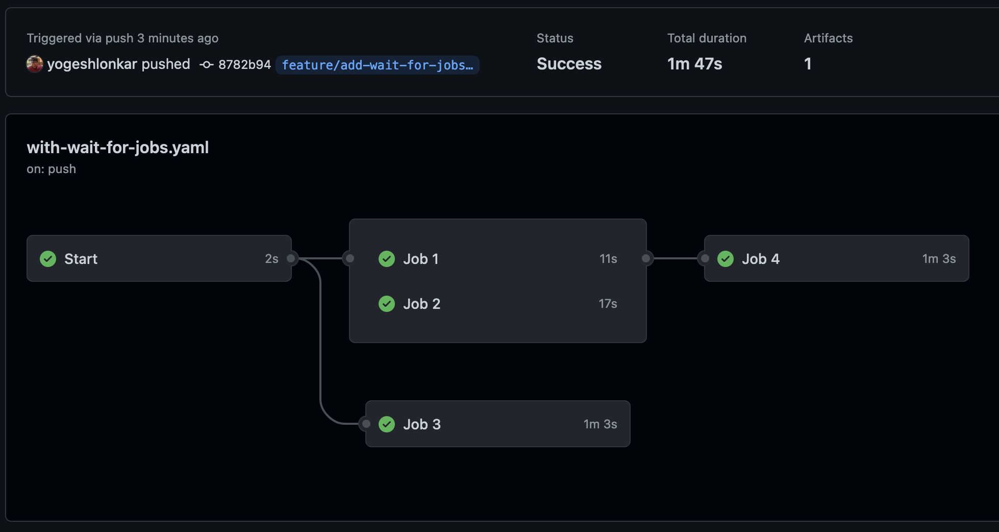

# Wait for jobs [](https://github.com/yogeshlonkar/wait-for-jobs/actions/workflows/on-push.yaml)

Currently GitHub Actions doesn't have a native way (`needs:`) to wait for jobs in a step. This action allows to wait for the specified jobs from the same run to be completed successfully before proceeding. Such a behavior is beneficial when dependee job has steps that can run/ finish before the job dependencies are completed or output from them is actually required.

[**Without wait-for-jobs**][without-wait-for-jobs-run]


In this scenario `Job 4` will wait for all job dependencies to be completed before starting even though some of the steps in `Job 4` can be started/ comepleted without `Job 3`

[**With wait-for-jobs**][with-wait-for-jobs-run]



In this scenario `Job 4` will start once `Job 1` and `Job 2` are completed. It will complete steps that don't require `Job 3`, after thoese steps it will wait for `Job 3` to complete. Prestarting `Job 4` reduces `Total duration` (not a Run time or Billable time) 

This action uses [GitHub API][jobs-for-a-workflow-run-attempt] to fetch latest status of jobs in current run, It also can use JSON artifacts from the same run to set output of this step to be used in next steps

## Usage

### Pre-requisites

This step requires below permission on its job. This permission is available by default to all the jobs but in case of reusable workflow the permission might be required to set on on both callee and caller job

```yaml
permissions:
  actions: read
```

### Input

```yaml
- uses: yogeshlonkar/wait-for-jobs@v0
  with:

    # To ignore jobs that are skipped from given list of job dependencies
    # default: 'false'
    # required: false
    ignore-skipped: 'false'

    # Comma or newline separated list of names of job dependencies for this step, it must be `name:` property of job if set
    # required: true
    jobs: 'job1,job2,Job 3'

    # Comma separated list of JSON artifacts from (jobs in) this build that will be parse to set as output for this step
    # required: false
    outputs-from: 'job1_output.json,job2_output.json'

    # Instead of exact job name match, check prefix of job names. Useful in case of reusable workflows
    # default: 'false'
    # required: false
    prefix: 'false'

    # Instead of exact job name match, check suffix of job names. Useful in case of reusable workflows
    # default: 'false'
    # required: false
    suffix: 'true'

    # Interval in milliseconds between each check of dependencies completion
    # default: '2000'
    # required: false
    interval: '2500'

    # Maximum number of minutes to wait before giving up. Step will fail with message providing remaining job names.
    # default: '5'
    # required: false
    ttl: '20'

    # If set to true, the ttl will NOT be overridden to 15 minutes if it is set more than 15 minutes
    # default: 'false'
    # required: false
    no-max-ttl: 'true'
```

### Output

This action has output named `outputs` which is JSON string generated by parsing and merging provided JSON artifacts from (jobs in) this run. Make sure the output file names and output names (keys) are unique for each job to avoid overwritting outputs

```yaml
- id: wait-for-jobs
  uses: yogeshlonkar/wait-for-jobs@v0
  with:
    gh-token: ${{ secrets.GITHUB_TOKEN }}
    jobs: |
      job1
      Job two
      Job 3
    outputs-from: output1.json,output2.json
- run: |
    echo ${{ fromJSON(steps.wait-for-jobs.outputs.outputs).out1 }}
    echo ${{ fromJSON(steps.wait-for-jobs.outputs.outputs).out2 }}
```

### ⚠️ Billing duration

The purpose of this action is to reduce Duration of workflow by prestarting dependee jobs. But waiting for jobs in a step/ action will increase Run time, Billable time. 
If the ttl is set more than 15 it will be overridden to 15 minutes. If depdencies requires more than 15 minutes to finish perhaps the dependee job steps should be split in separate jobs not prestart together but if you still wish to wait more than that you can set `no-max-ttl: 'true'`


[jobs-for-a-workflow-run-attempt]: https://docs.github.com/en/rest/actions/workflow-jobs#list-jobs-for-a-workflow-run-attempt
[with-wait-for-jobs-run]: https://github.com/yogeshlonkar/wait-for-jobs/actions/runs/3077494840
[without-wait-for-jobs-run]: https://github.com/yogeshlonkar/wait-for-jobs/actions/runs/3077494839
